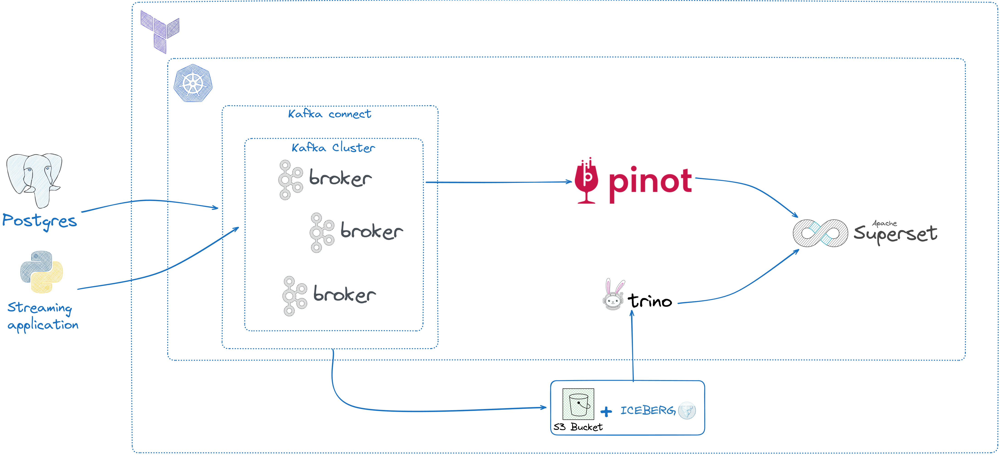

# oss-analytics-streaming
Repository aims to deliver a fully open-source streaming data platform. The following image is what we're going to achive with this repository. This is a W.I.P. 



# Pre requisites
- Understanding of Kubernetes
- Understanding of kakfa ecosystem
- Minkube
- Kubectl
- Kubens
- kubernetes 1.25+
- Strimzi kafka

# Installing components

## Minikube
```sh 
minikube start --cpus=2 \
--memory='3g' \
--nodes=3
```

## Storage class
After creating a minikube cluster, there're some caveats that needs to be addressed. The minikube's default storage class don`t work with more than 1 node by design, which means kafka will fail as it needs to write files on disk. To fix the issue, we need to remove the default storage class, and then create another one that works with multi node

```sh 
kubectl delete sc default

kubectl apply -f https://raw.githubusercontent.com/rancher/local-path-provisioner/v0.0.30/deploy/local-path-storage.yaml
```

## Strimzi Kafka

Following strimzi best practices, it is recommended to deploy the operator and other kafka components (kafka connect, kafka cluster) into different namespaces. Here we're going to create 2 namespaces:

```sh 
kubectl create namespace kafka -> where our kafka components will be deployed

kubeclt create namespace kafka-operator -> where kafka operator will be deployed
```

Select the namespace to deploy the strimzi operator
```sh 
kubens kafka-operator
```

We have to make sure the operator will watch kafka and kafka-operator namespace. That's why we have to install the RoleBindings for both kafka and kafka-operator namespaces:

```sh 
kubectl create -f strimzi/install/cluster-operator/020-RoleBinding-strimzi-cluster-operator.yaml -n <namespace>

kubectl create -f strimzi/install/cluster-operator/023-RoleBinding-strimzi-cluster-operator.yaml -n <namespace>

kubectl create -f strimzi/install/cluster-operator/031-RoleBinding-strimzi-cluster-operator-entity-operator-delegation.yaml -n <namespace>
```

Now it's time to deploy the CRDs and the operator

```sh 
kubectl create -f strimzi/install/cluster-operator -n kafka-operator
```

Now that strimzi operator is configured, it's time to deploy our kafka cluster, topic operator and user operator. Deploying kafka cluster in Kraft mode is the modern way to manage a fresh kafka cluster, and we're going to deploy it that way

Apply the configuration

```sh 
kubectl apply -f strimzi/examples/kafka/kraft/kafka-with-dual-role-nodes.yaml
```

Install kafka connect

```sh 
kubectl apply -f strimzi/examples/connect/kafka-connect.yaml
```

# Running the Python Producer

Install poetry

```sh 
pip install poetry
```

Install the project

```sh 
cd python-kafka-producer
poetry install
```

Activate the virtual env
```sh 
source .venv/bin/activate
```